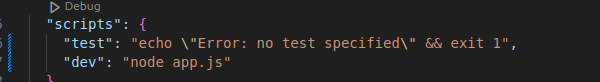
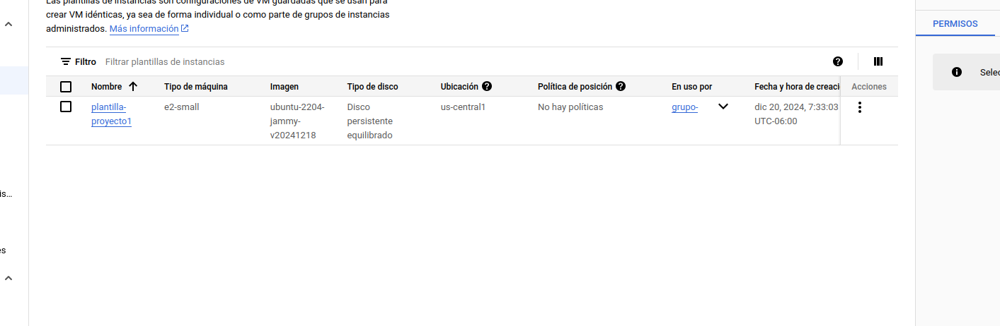
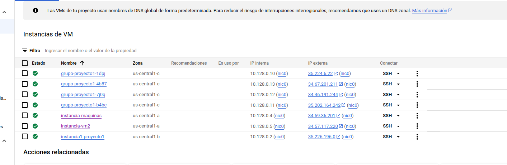

## Universidad de San Carlos de Guatemala
## Facultad de Ingeniería
## SISTEMAS OPERATIVOS 1

| Nombre   | Carnet| 
|----------|----------|
| Kelly Mischel Herrera Espino   | 201900716   |

# INRODUCCION
### El presente manual es una guia para el uso de docker y docker compose, se detalla a continuacion los comandos que se utilizaron durante el desarrollo del proyecto. En el cual se dejan notas de como utilizar optimamente dichos comandos. Tambien algunos fueron soluciones que se colocaron para que se ejecutara algun script.

## Comando para DOCKER

### Para instalra docker necesitamos utilizar los siguientes comandos:

## Instalar docker

### Actualizacion de paquetes

    sudo apt-get update

### Instalacion de dependencias

    sudo apt-get install ca-certificates curl gnupg

### Agreguar clabe GPC oficial de Docker
    sudo install -m 0755 -d /etc/apt/keyrings
    
    sudo curl -fsSL https://download.docker.com/linux/ubuntu/gpg -o /etc/apt/keyrings/docker.asc

### Configuarar el repositorio
    echo \ 
    "deb [arch=$(dpkg --print-architecture) signed-by=/etc/apt/keyrings/docker.asc] https://download.docker.com/linux/ubuntu \
    $(. /etc/os-release && echo "$VERSION_CODENAME") stable" | \
    sudo tee /etc/apt/sources.list.d/docker.list > /dev/null
    sudo apt-get update

### Instalacion de Docker Engine
    sudo apt-get install docker-ce docker-ce-cli containerd.io docker-buildx-plugin docker-compose-plugin

### Estado de Docker
    sudo systemctl status docker

### Versiones de Docker
    docker version
### Version de docker compose
    docker compose version

## Comandos para crear una imagen

# Para ver los procesos
Para ver los proceso se utiliza el comando:

    ps aux

    gcc --version
    make --version

### Crear las carptes
Carpeta Backend

    mkdir Backend

Carpeta RAM

    mkdir ram

Carpeta CPU

    mkdir CPU

## Modulo para la memoria RAM

Crear un archivo ram.c con las configuraciones correspondientes

Crear un Makefile

### COmando para compilar el Makefile
    make all
### Comando para limpiear
Con este comando se quitan los archivos que ya no son necesarrios

    make clean
### Nota
No colocar nombres con espacios en las carpetas en donde estara el makefile

### Comandos para compilar
    sudo apt install gcc-12
### insertar el modulo
    sudo insmod <nombre del modulo>
    sudo insmod ram_201900716.ko
    sudo insmod cpu_201900716.ko
### revision de la insercion
    sudo dmesg
### 
    cd /proc/

### 
    cat ram
### para eliminar
    sudo rmmod cpu_201900716.ko
    sudo rmmod ram_201900716.ko

## MODULO CPU
### COmando para compilar el Makefile
    make all
sudo make -C /lib/modules/$(uname -r)/build M=$(pwd) modules

### Comando para limpiear
    make clean
### Nota
No colocar nombres con espacios en las carpetas en donde estara el makefile

### Comandos para compilar
    sudo apt install gcc-12
### insertar el modulo
    sudo insmod <nombre del modulo>
    sudo insmod cpu_201900716.ko
### revision de la insercion
    sudo dmesg
### 
    cd /proc/

    cat cpu_201900716
### para eliminar
    sudo rmmod cpu_201900716.ko

## COMANDOS PARA GO

    go run main.go

    go mod init main.go
### go get
    go get github.com/gorilla/handlers
    go get github.com/gorilla/mux
    go get github.com/shirou/gopsutil/cpu

## DOCKER IMAGES
Para cear una image se debe de crear un archivo Dockerfile,
en dicho archivo se deben de colocar las especificaciones correspondientes a lo que se 
desea realizar.

### Comando para construisr una imagen
    docker build -t nombre_imagen .

Nota: se debe de colocar el punto del final.

### Ejecutar una imagen
    sudo docker run -d -p <<puerto a exponer>>:<<puerto del contenedor>> <<nombre imagen>>

    sudo docker run -d -p 5200:5200 image_go

### Ver imagenes construidas
    sudo docker images

### Ver los contenedores     
    sudo docker ps -a
### Eliminar todas las imagenes
    docker image prune -a

##  Contenedores
### Ver los contenedores activos
    sudo docker ps
### Apagar un contenedor 
    sudo docker container stop id_contenedor

### Eliminar los contenedores que estan detenidos
    sudo docker container prune
### ELiminar contenedor por id
    docker rm <nombre-o-id-del-contenedor>

## DOCKER HUB
### Primero crear una cuenta
### Segundo se debe de crear un repositorioi publico

### Iniciar sesion desde la Terminal
    docker login

Nos redirige a una pagina web y damos click en confirmar.
EN la consola aparecer el mensage Login Succeeded.

### Agregar un tag a la imagen
### Imagen de GO
    sudo docker tag 5f0f5a145f2d kelly901/image_go:v1
### Imagen de node
    sudo docker tag 99a89f52a90d kelly901/node_image:v1
    
### Subir una image a Docker Hub

    docker push <nombre_de_usuario>/<nombre_de_imagen>:<tag>

## image_go
    docker push kelly901/image_go:v1

## node_image
    docker push kelly901/node_image:v1

## image_mysql
-----------------------------------------------------

# Volumenes

### listar los volumnes
    sudo docker volume ls
### Crear un volumen
    docker volume create nombre-db
    docker volume create mysql-db

### Comando para inspeccionar en donde esta el volumen
    docker volume inspect mysql-data

### Levantar el docker-compose
    sudo docker-compose up
### INICIAR EL CONTENEDOR
    docker start id_contenedor
### Acceder a la base de datos
    sudo docker exec -it basededatos-container mysql -u${MYSQL_USER} -p${MYSQL_PASSWORD}
    sudo docker exec -it basededatos-container mysql kelly 1234

### matar el volumen
   Docker-compose down - v 

### Ver todos los contenedores aunque no esten en ejecucion
    sudo docker ps -a

### Crea y ejecuta conetenedores de Docker
Este comando ejecuta los conentededores forzando la reconstruccion de las imagenes asociadas.

    sudo docker-compose up --build

# API NODE
## CREAR LA API DE NODE
    
    cd api-nodejs

#### DEPENDENCIAS
    npm init -y

#### Instalacion de las librerias express, mysql2 y body-parser
    npm install express mysql2 body-parser

#### Ejecutar la aplicacion de Node
    node <nombre_aplicaccion>

**Comando para ejecunta con run dev**

# Configuracion maquina virtual

    sudo apt update
    sudo apt install git
    docker login

## clonar el repo
    git clon https://github.com/Kelly901/SO1_VAC_DIC_2024_201900716_.git

### Comandos para gcc
    sudo apt install gcc-12

### Crear las carptes
#### Carpeta Backend

    mkdir Backend

#### Carpeta RAM

    mkdir ram

#### Carpeta CPU

    mkdir CPU

### Comandos para compilar
    sudo apt install gcc-12
### insertar el modulo
    sudo insmod <nombre del modulo>
    sudo insmod ram_201900716.ko
    sudo insmod cpu_201900716.ko
## revisar la insersion
     sudo dmesg

### Comando para compilar el Makefile
    make all

## En caso de que de problema la ejecucion del make all, se puede utilizar el siguiente comando:
    sudo make -C /lib/modules/$(uname -r)/build M=$(shell pwd) modules

## Virtualizacion

### Plantilla
Para la plantilla se uso un script para automatizar la cracion de las maquinas virtuales.

### Grupos
Se creo un grupo a partir de la plantilla con un minimo de 1 maquina y un maximos de 4

### Instancias

